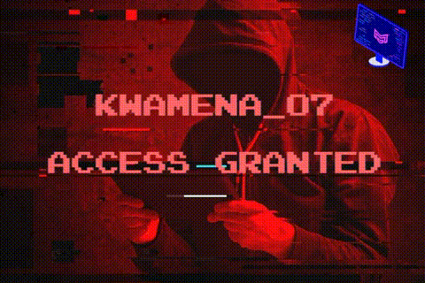

<h1 align="center" <b>     Kwamena  </h1>

<!--<h2 align="center"> Last Seen :watch: Thursday, October 13, 11:09 AM UTC </h2> -->

<h6 align="center"> Very Focused Individual, Software Engineer and a Cybersecurity student; with much interest to Learn New things, Create and Bring Change in this Modern Tech World to make the world a Better Place. </h6>

  <a href="https://github.com/DenverCoder1/readme-typing-svg">

	

##

##### Web Developmental Progress so Far
<code></code>
<code></code>
<code></code>
<code></code>
<!-- <code></code> -->
 

   
   

	
	
	
  
<b> 👨🏾‍💻🌈👨🏾‍💻⚡Most Used Languages 👨🏾‍💻🌈👨🏾‍💻⚡</b>
  
	   
  
<b> 💥💥 Github Streaks 💥💥</b>

   
  
    
	
   
  
<b> ⚡👨🏾‍💻🌈👨 Github Stats 👨🏾‍💻🌈👨🏾‍💻⚡ </b>

     
  

	
	

 

  

												             
                      
I Will Always Remember.
					      

<!--
 -->

